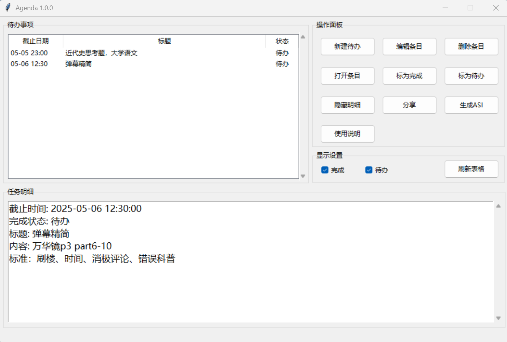

# Agenda-memo
一个非常简易的备忘录，给每个待办设置截止日期，直观查看待办事项。
使用MySQL存储数据。

**Python初学者，代码写的并不好，一些用法也是边学边做的。**

## 项目介绍

本项目的核心功能是记录待办事项，

只包括新建，编辑，删除等基本功能。

目前正在拓展功能，提升使用体验。

主界面如下展示（分享不可用）



**提示：如果可以尽量使用本地数据库， `sql.py` 内一切对数据库的操作只保证能用，不保证安全，建议自行优化**

## 安装相关库

```
pip install pymysql

pip install tkcalendar

pip install pyinstaller
```

## 使用教程

### 1. 配置数据库
**这方面不熟悉担心误导，只提供流程，具体实现方法请自行解决。**
1. 创建一个数据库
2. 创建一个账号，要有对该数据库的读写权限
3. 创建表 `acps` 和 `license`:
```
CREATE TABLE acps (
	username VARCHAR(50) NOT NULL PRIMARY KEY,
	password VARCHAR(50) NOT NULL
);
```
```
CREATE TABLE license (
	username VARCHAR(50) NOT NULL PRIMARY KEY,
	keyMD TEXT NOT NULL
);
```

### 2. 修改信息

在 `sql.py` 中，根据你的数据库替换信息
```
connect = pymysql.connect(  
    host='<YOURHOST>',  
    port=3306,  
    user='<USERNAME>',  
    passwd='<PASSWORD>',  
    db='<DATABASE>'
)
```

运行 `sql.py` 进行测试，正常情况下应当在数据库中生成表 `aaaa_agd`

表 `acps` 中存在一行，对应信息为： `username: aaaa` `password: bbbb`

表 `license` 中存在一行，对应信息为： `username: aaaa` `keyMD: 74b87337454200d4d33f80c4663dc5e5`

确认无误后运行 `login.py` 即可开始使用。

### 3. 打包
打包 `login.py`
```
pyinstaller -w -F login.py -i hot.ico
```

### 4. 如何使用Agenda？
运行程序，点击主界面“使用说明”
